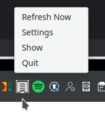
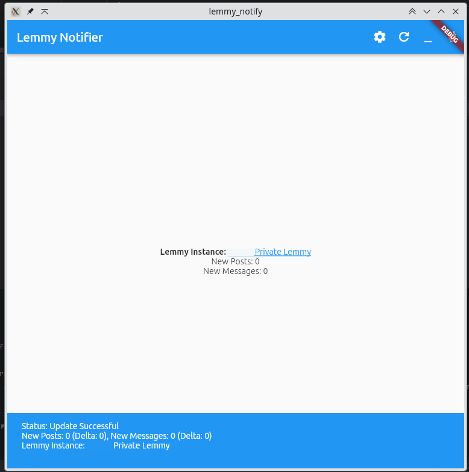
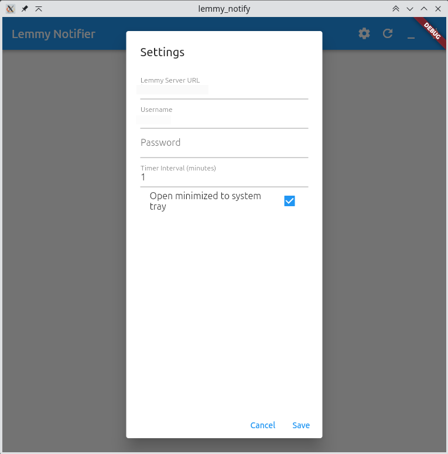

# lemmy_notify

Lemmy Notification Project.

This sits in your system tray and will display one of the following icons depending on what what's 
available.

| Icon | Why                        |
| --- |----------------------------|
|  | No Updates                 |
|  | You have private messages  |
|  | You have new posts to view |

# Screen caps

Tray icon and menu:

Main app window:

Settings:

